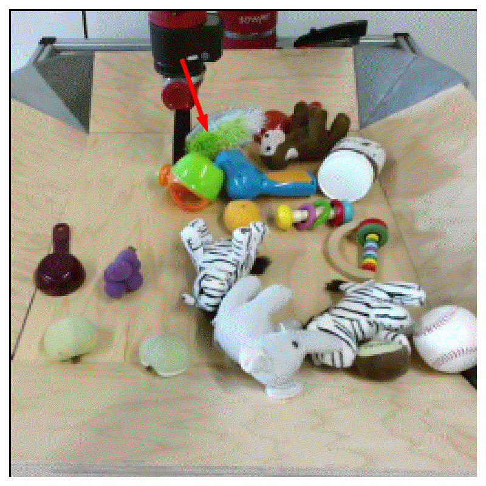
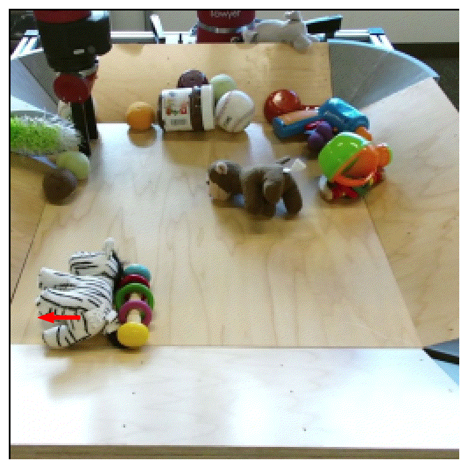

<h1 align="center">
  <br>
	Learn the Force We Can: Enabling Sparse Motion Control in Multi-Object Video Generation
  <br>
</h1>
  <p align="center">
    <a href="https://araachie.github.io">Aram Davtyan</a> •
    <a href="https://www.cvg.unibe.ch/people/favaro">Paolo Favaro</a>
  </p>
<h4 align="center">Official repository of the paper</h4>

<h4 align="center">at AAAI 2024</h4>

<h4 align="center"><a href="https://araachie.github.io/yoda/">Website</a> • <a href="https://arxiv.org/abs/2306.03988">Arxiv</a>

<p float="left">
  
  
  
</p>

#
> **Abstract:** *We propose a novel unsupervised method to autoregressively
> generate videos from a single frame and a sparse motion input.
> Our trained model can generate unseen realistic object-to-
> object interactions. Although our model has never been
> given the explicit segmentation and motion of each object in
> the scene during training, it is able to implicitly separate their
> dynamics and extents. Key components in our method are the
> randomized conditioning scheme, the encoding of the input
> motion control, and the randomized and sparse sampling to
> enable generalization to out of distribution but realistic correlations.
> Our model, which we call YODA, has therefore
> the ability to move objects without physically touching them.
> Through extensive qualitative and quantitative evaluations on
> several datasets, we show that YODA is on par with or better
> than state of the art video generation prior work in terms of
> both controllability and video quality.*

## Citation

The paper is to appear in the Proceeding of the 38th AAAI Conference in Artificial Intelligence.
In the meantime, we recommend using the following bibref to the arxiv preprint.

A. Davtyan, P. Favaro. Learn the Force We Can: Multi-Object Video Generation from Pixel-Level Interactions. arXiv preprint, 2023.

```
@misc{davtyan2023learn,
      title={Learn the Force We Can: Multi-Object Video Generation from Pixel-Level Interactions}, 
      author={Aram Davtyan and Paolo Favaro},
      year={2023},
      eprint={2306.03988},
      archivePrefix={arXiv},
      primaryClass={cs.CV}
}
```

## Prerequisites

For convenience, we provide an `environment.yml` file that can be used to install the required packages 
to a `conda` environment with the following command 

```conda env create -f environment.yml```

The code was tested with cuda=12.1 and python=3.9.

## Pretrained models

We share the weights of the models pretrained on the datasets considered in the paper.

<table style="margin:auto">
    <thead>
        <tr>
          <th>Dataset</th>
          <th>Resolution</th>
          <th>Training iterations</th>
          <th>Autoencoder</th>
          <th>Main model</th>
        </tr>
    </thead>
    <tbody>
        <tr>
            <td>BAIR</td>
            <td>256 x 256</td>
            <td>300k</td>
            <td><a href="https://huggingface.co/cvg-unibe/yoda_bair_256/blob/main/vqvae.ckpt">download</a></td>
            <td><a href="https://huggingface.co/cvg-unibe/yoda_bair_256/blob/main/model.pth">download</a></td>
        </tr>
        <tr>
            <td>CLEVRER</td>
            <td>128 x 128</td>
            <td>300k</td>
            <td><a href="https://huggingface.co/cvg-unibe/yoda_clevrer_128/blob/main/vqvae.pth">download</a></td>
            <td><a href="https://huggingface.co/cvg-unibe/yoda_clevrer_128/blob/main/model.pth">download</a></td>
        </tr>
        <tr>
            <td>iPER</td>
            <td>128 x 128</td>
            <td>60k</td>
            <td><a href="https://huggingface.co/cvg-unibe/yoda_iper_128/blob/main/vqvae.ckpt">download</a></td>
            <td><a href="https://huggingface.co/cvg-unibe/yoda_iper_128/blob/main/model.pth">download</a></td>
        </tr>
    </tbody>
</table>

## Running pretrained models

To use a model that was trained with the code in this repository, 
you may utilize the `generate_frames` method of the model class.
Usage example:

```angular2html
from lutils.configuration import Configuration
from lutils.logging import to_video
from model import Model

config = Configuration(<path_to_config_file>)
model = Model(config["model"])
model.load_from_ckpt(<path_to_checkpoint_file>)
model.cuda()
model.eval()

generated_frames = model.generate_frames(
    initial_images.cuda(),  # of shape [b n c h w] 
    sparse_flows.cuda(),  # of shape [b k 3 h w], where the sparse flow map is concatenated with the sparse mask in dim=2    
    num_frames=16,
    verbose=True)

generated_frames = to_video(generated_frames)
```

## Demo notebook

For the best experience with our pretrained models, check the `demo.ipynb` file.


## Training your own models

To train your own video prediction models you need to start by preparing the data. 

### Datasets

The training code expects the dataset to be packed into .hdf5 files in a custom manner. 
To create such files, use the provided `dataset/convert_to_h5.py` script. 
Usage example:

```angular2html
python dataset/convert_to_h5.py --out_dir <directory_to_store_the_dataset> --data_dir <path_to_video_frames> --image_size 128 --extension png
```

The output of `python dataset/convert_to_h5.py --help` is as follows:

```angular2html
usage: convert_to_h5.py [-h] [--out_dir OUT_DIR] [--data_dir DATA_DIR] [--image_size IMAGE_SIZE] [--extension EXTENSION] [--with_flows]

optional arguments:
  -h, --help            show this help message and exit
  --out_dir OUT_DIR     Directory to save .hdf5 files
  --data_dir DATA_DIR   Directory with videos
  --image_size IMAGE_SIZE
                        Resolution to resize the images to
  --extension EXTENSION
                        Video frames extension
  --with_flows          If defined, add precomputed flows to the dataset
```

The video frames at `--data_dir` should be organized in the following way:

```angular2html
data_dir/
|---train/
|   |---00000/
|   |   |---flows/  # Optional precomputed flows
|   |   |   |---00000.npy
|   |   |   |---00001.npy
|   |   |   |---00002.npy
|   |   |   |---...
|   |   |---00000.png
|   |   |---00001.png
|   |   |---00002.png
|   |   |---...
|   |---00001/
|   |   |---flows/
|   |   |   |---00000.npy
|   |   |   |---00001.npy
|   |   |   |---00002.npy
|   |   |   |---...
|   |   |---00000.png
|   |   |---00001.png
|   |   |---00002.png
|   |   |---...
|   |---...
|---val/
|   |---...
|---test/
|   |---...
```

Here `00000.npy` stores a numpy float array of shape `[2 h w]` that represents the forward flow between `00000.png` and `00001.png`.

To extract individual frames from a set of video files, we recommend using the `convert_video_directory.py` script from the [official PVG repository](https://github.com/willi-menapace/PlayableVideoGeneration#custom-datasets).

**BAIR:** Collect the dataset following instruction from the [official PVG repository](https://github.com/willi-menapace/PlayableVideoGeneration#preparing-datasets).

**CLEVRER:** Download the videos from the [official dataset's website](http://clevrer.csail.mit.edu/).

**iPER:** Download the videos from the [official dataset's website](https://svip-lab.github.io/dataset/iPER_dataset.html).

### Training autoencoder

We recommend to use the official [taming transformers repository](https://github.com/CompVis/taming-transformers) for 
training VQGAN. To use the trained VQGAN at the second stage, update the `model->autoencoder` field in the config accordingly. 
To do this, set `type` to `ldm-vq`, `config` to `f8_small`, `f8` or `f16` depending on the VQGAN config that was used at training.
We recommend using low-dimensional latents, e.g. from 4 to 8, and down-sampling images at least to 16 x 16 resolution. 

Besides, we also provide our own autoencoder architecture at `model/vqgan/vqvae.py` that one may use to train simpler VQVAEs.
For instance, our pretrained model on the CLEVRER dataset uses this custom implementation.

### Training main model

To launch the training of the main model, use the `train.py` script from this repository.
Usage example:

```angular2html
python train.py --config <path_to_config> --run-name <run_name> --wandb
```

The output of `python train.py --help` is as follows:

```angular2html
usage: train.py [-h] --run-name RUN_NAME --config CONFIG [--num-gpus NUM_GPUS] [--resume-step RESUME_STEP] [--vqvae-path VQVAE_PATH] [--random-seed RANDOM_SEED] [--wandb]

optional arguments:
  -h, --help            show this help message and exit
  --run-name RUN_NAME   Name of the current run.
  --config CONFIG       Path to the config file.
  --num-gpus NUM_GPUS   Number of gpus to use for training. By default uses all available gpus.
  --resume-step RESUME_STEP
                        Step to resume the training from.
  --random-seed RANDOM_SEED
                        Random seed.
  --wandb               If defined, use wandb for logging.
```

Use the configs provided in this repository as examples. 
